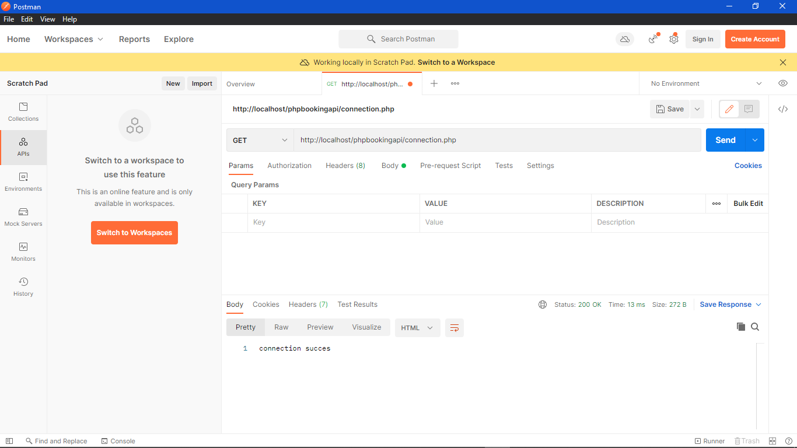
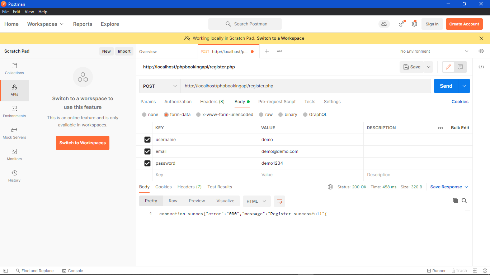
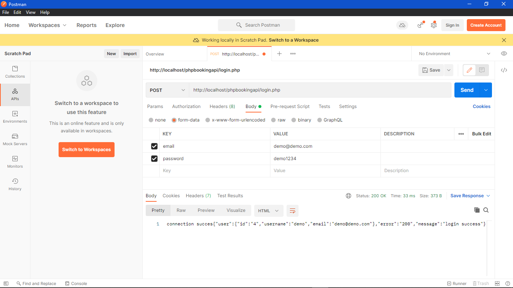
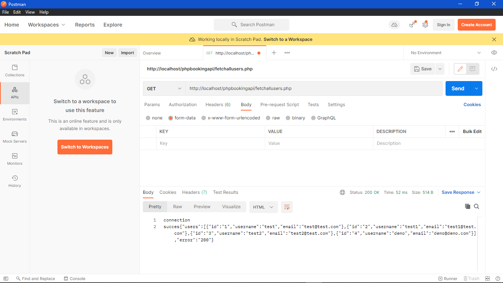

# phpbookingapi

 - Add connection details in connection.php
   
 - Register user using POST request - username, email and password as form data
 
 - Login using email and password
 
 - Fetch all users (add authnetication POST Testing ) using fetchallusers.php
 
 - Update, Delete user and password using respective files for same
 